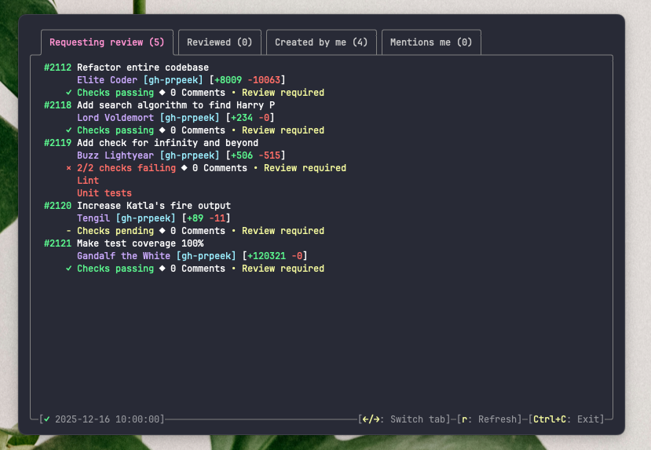

# prpeek 👀


Show status of relevant GitHub pull requests live



## Installation

1. Install GitHub CLI: https://cli.github.com/
2. Install prpeek as a GitHub CLI extension:

```bash
gh extension install balfons/gh-prpeek
```

## Update

```bash
gh extension upgrade balfons/gh-prpeek
```

## Usage

**Example**

```bash
gh prpeek --repos balfons/gh-prpeek,oven-sh/bun --labels bug,feature
```

**Options**

```bash
  -V, --version              output the version number
  -r, --repos <repos>        Repositories to target: OWNER/REPO
  -i, --interval <interval>  Update interval in seconds (default: "60")
  -n, --notify               Notification when a new PR is added or when one of your PRs becomes mergable (default: true)
  --reviewed                 Show PRs that you have reviewed (default: true)
  --mentioned                Show PRs that mentions you (default: true)
  --hide-checks              Hide result of failing individual checks (default: false)
  --show-labels              Show labels on pull requests (default: false)
  -l, --labels <items>       Only show pull requests that needs review from you with any of the specified labels
  -h, --help                 display help for command
```

## Develop

**Install dependencies**

```bash
bun install
```

**To run**

```bash
bun start --repos <owner>/<repository>
```

**To compile**

```bash
bun compile
```

**Run compiled executable**

```bash
./dist/gh-prpeek --repos <owner>/<repository> --labels bug,feature
```
