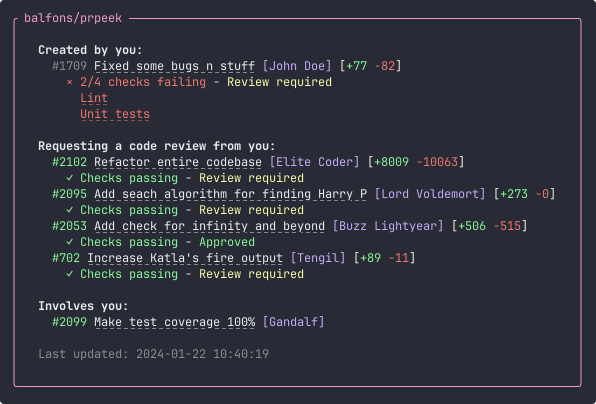

# prpeek 👀
Show status of relevant GitHub pull requests live



## Installation
1. Install GitHub CLI: https://cli.github.com/
2. Install prpeek as a GitHub CLI extension:
```bash
gh extension install prpeek
```

## Usage 

**Example**
```bash
gh prpeek --repos balfons/gh-prpeek,oven-sh/bun --notify --interval 20 --labels bug,feature --involved
```

**Options**
```bash
  -r, --repos <repos>        Repositories to target: OWNER/REPO
  -i, --interval <interval>  Update interval in seconds (default: "15")
  -n, --notify               Notification when a new PR is added or when one of your PRs becomes mergable (default: false)
  --involved                 Show additional PRs where you are involved (default: false)
  -l, --labels <items>       Only show pull requests that needs review from you with any of the specified labels
  -h, --help                 display help for command
  -V, --version              output the version number
```


## Develop
**Install dependencies**

```bash
bun install
```

**To run**

```bash
bun start --repos <owner>/<repository>
```

**To compile**
```bash
bun compile
```

**Run compiled executable**
```bash
./gh-prpeek --repos <owner>/<repository> --notify --interval 15 --labels bug,feature --involved
```